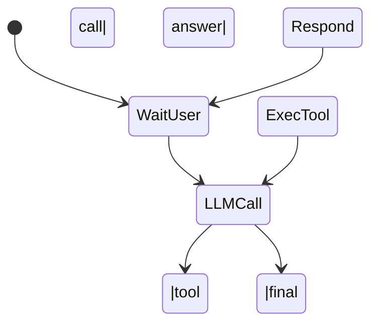

# LLM-Powered Spreadsheet Integration: Technical Architecture and Workflow

## Introduction

In modern finance and analytics, professionals like investment bankers handle large spreadsheets and need quick insights. Imagine a New York investment banker who can simply ask, _“Analyze this sales data for me,”_ and get an immediate report with pivot tables, totals, and charts.  
Our goal is to build an **LLM‑integrated spreadsheet assistant** that lets users control **every spreadsheet function** through chat.  
This document provides a complete technical specification for implementing that assistant on a serverless stack (Vercel + Next.js + Tailwind + Univer.js Sheets) with OpenAI GPT‑4 function calling and a tool‑based agent loop.

---

## 1. High‑Level Architecture

```mermaid
flowchart TD
    A[User] -->|chat| B(Next.js UI)
    B -->|prompt + history| C(OpenAI LLM<br/>via Vercel AI SDK v5)
    C -->|function call JSON| D[Agent Orchestrator<br/>(serverless function)]
    D -->|executes| E[Tools (JS functions)]
    E -->|read/write| F[Spreadsheet Data<br/>(Univer.js Workbook)]
    E -->|optional| G[Chart Service<br/>(QuickChart / Canvas)]
    F -->|updates| H[Embedded Spreadsheet UI<br/>(Univer React component)]
    D -->|tool result| C

    C -->|final answer| B
```

**Key components**
| Layer | Tech | Purpose |
|-------|------|---------|
| Front‑end | Next.js app, Tailwind | Chat panel + embedded spreadsheet canvas |
| LLM core | OpenAI GPT‑4‑0613 | Interprets user intent; decides tool calls |
| Tools | JS functions exposed via Vercel AI SDK | Deterministic spreadsheet ops (pivot, sum, chart, etc.) |
| Orchestrator | Serverless route (`/api/chat`) | Runs loop: LLM → tool → LLM until final reply |
| Spreadsheet engine | **Univer.js Sheets** | Full Excel‑like workbook in browser & Node |
| Storage | In‑memory per request, optional temp cache | Holds parsed data; charts saved to URL if needed |

---

## 2. LLM Configuration

### 2.1 System Prompt (template)

```text
You are a spreadsheet analysis assistant for finance professionals.
You have function‑calling access to precise tools.
Always call a tool for any answer that requires data from the sheet.
Never fabricate numbers. Summarize insights clearly.
```

### 2.2 Model Parameters

| Setting     | Value                    | Rationale                       |
| ----------- | ------------------------ | ------------------------------- |
| model       | `gpt-4o` or `gpt‑4‑0613` | Supports JSON tool calls        |
| temperature | 0‑0.2                    | Deterministic, numeric accuracy |
| max tokens  | 4096 (assist)            | Plenty for multi‑step loops     |

---

## 3. Tool Definitions

> **All tools are registered with the AI SDK’s `tool()` helper (zod schema).**

### 3.1 `list_columns`

Returns column names & row count.  
_No input._

### 3.2 `create_pivot_table`

```jsonc
{
  "groupBy": "Region",
  "valueColumn": "Sales",
  "aggFunc": "sum",
  "filter": { "Year": 2025 } // optional
}
```

Returns JSON pivot array **and** writes a table to sheet.

### 3.3 `calculate_total`

```json
{ "column": "Sales", "filter": null }
```

Returns single number.

### 3.4 `generate_chart`

```jsonc
{
  "data": "<pivotResult>",
  "x": "Region",
  "y": "Sales_sum",
  "chart_type": "bar",
  "title": "Total Sales by Region"
}
```

Creates PNG via QuickChart; inserts image to “Dashboard” sheet; returns URL.

_(Add more: `apply_conditional_format`, `insert_formula`, `create_sheet`, etc.)_

---

## 4. Agent Loop (Orchestrator)

```ts
while (true) {
  const llmResp = await openai.chat.completions(...);
  if (llmResp.finish_reason === "stop") return llmResp.message;
  if (llmResp.message.function_call) {
      const {name,args} = llmResp.message.function_call;
      const toolResult = await tools[name].execute(JSON.parse(args));
      messages.push({role:"function", name, content: JSON.stringify(toolResult)});
  }
}
```

_Pseudocode; AI SDK can automate this._

---

## 5. End‑to‑End Example

**User:** “Analyze the sales data provided.”

1. `calculate_total` → total $5 M
2. `create_pivot_table` (by Region) → pivot JSON
3. `generate_chart` (bar) → Chart1 URL + insertion
4. `create_pivot_table` (by Product) → pivot2
5. `generate_chart` (pie) → Chart2
6. LLM final: summary text + references to Dashboard sheet.

---

## 6. Data Handling

- Parse upload (XLSX/CSV) → array of objects in memory.
- Provide schema via `list_columns` result at chat start.
- Large datasets: tools stream/aggregate; avoid dumping >2k rows to LLM.

---

## 7. Serverless Deployment (Vercel)

- Each `/api/chat` invocation handles one user message.
- Use Edge Config or KV for temporary workbook cache keyed by session.
- Env vars: `OPENAI_API_KEY`, `QUICKCHART_HOST`, etc.
- Cold‑start mitigations: keep functions small, use wasm/xlsx parsers.

---

## 8. Security & Compliance

- Disable OpenAI data logging if needed.
- No arbitrary code execution; only whitelisted tools.
- Log tool calls for audit (“who changed what”).

---

## 9. Developer Checklist

- [ ] Implement & unit‑test each tool.
- [ ] Validate JSON schema compliance in tool calls.
- [ ] Populate system prompt with sheet schema on every request.
- [ ] Integrate Univer.js UI and sheet‑update hooks.
- [ ] Perform load test with ≥10 k rows.

---

## Appendix A. Mermaid State Diagram (Agent Loop)



---

_Last updated: 01 Aug 2025_
