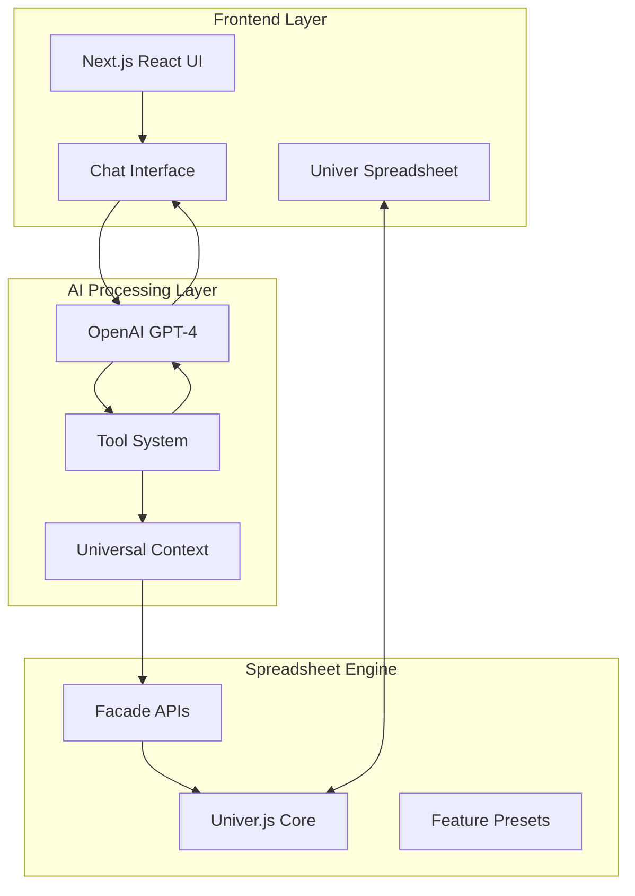
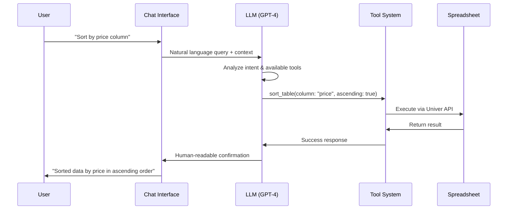
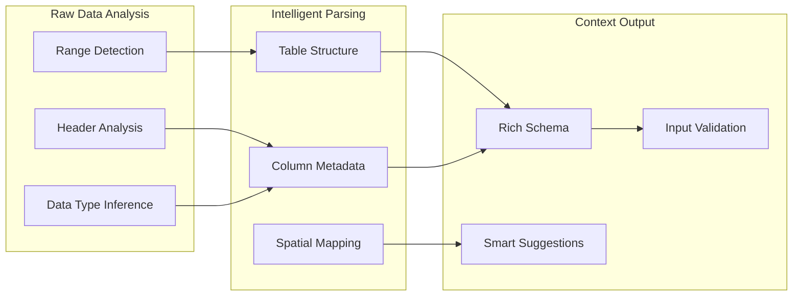
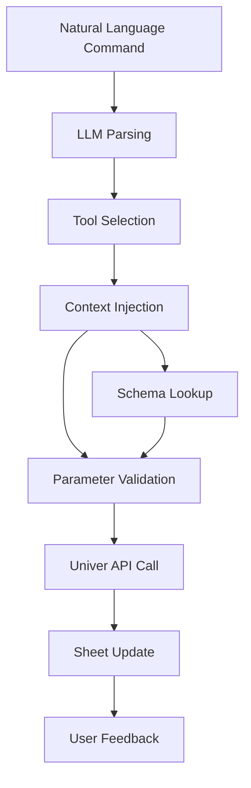
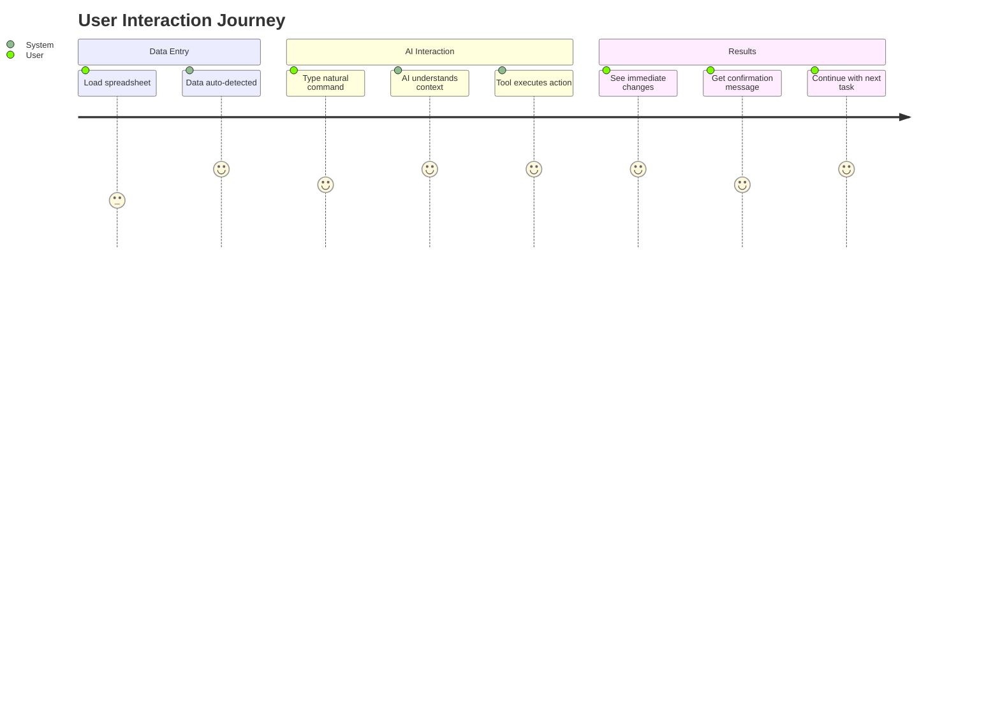

# UltraSheets: AI-Powered Spreadsheet Intelligence
*Presentation Notes for Semi-Technical Audience*

---

## <¯ Executive Summary

UltraSheets revolutionizes spreadsheet interaction by integrating Large Language Models (LLMs) with the powerful Univer.js spreadsheet framework. Users can manipulate data, create charts, format cells, and perform complex operations using natural language commands.

**Key Innovation**: Real-time context awareness allows the AI to understand your spreadsheet structure, data types, and relationships without manual configuration.

---

## <× Architecture Overview



---

## >à How the LLM Integration Works

### 1. Natural Language Processing
- **Input**: User types commands like "sort by price ascending" or "add totals to all numeric columns"
- **Processing**: OpenAI GPT-4 analyzes the intent and determines which tools to use
- **Output**: Structured function calls with parameters

### 2. Tool-Based Execution System


### 3. Available Tool Categories
- **Data Tools**: Sort, filter, add columns, smart totals
- **Format Tools**: Currency formatting, conditional formatting
- **Analysis Tools**: Chart generation, data insights
- **Structure Tools**: Table detection, range operations
- **Navigation Tools**: Workbook snapshots, context analysis

---

## =Ê Context Intelligence System

### Universal Context Framework
The system automatically understands your spreadsheet without manual setup:



### What the AI "Sees"
When you ask the AI to perform an action, it receives rich context:

```typescript
// Example context passed to LLM
{
  tables: [{
    id: "primary",
    range: "A1:D15",
    headers: ["Product", "Price", "Quantity", "Date"],
    columns: [
      { name: "Product", type: "text", index: 0 },
      { name: "Price", type: "currency", index: 1, isCurrency: true },
      { name: "Quantity", type: "number", index: 2 },
      { name: "Date", type: "date", index: 3 }
    ]
  }],
  calculableColumns: ["Price", "Quantity"],
  spatialMap: { /* optimal placement zones */ }
}
```

---

## =' Technical Implementation Details

### 1. Spreadsheet Engine: Univer.js
- **Modern Architecture**: Built on TypeScript with plugin system
- **Feature Rich**: Charts, formulas, filtering, sorting, conditional formatting
- **Facade Pattern**: Clean API layer for programmatic access

### 2. Tool Execution Flow


### 3. Real-Time Context Updates
- **Invalidation System**: Tools mark when they change data structure
- **Lazy Loading**: Context refreshes only when needed
- **Caching**: Expensive operations cached until invalidation

---

## =¡ Key Innovations

### 1. No Configuration Required
- Traditional spreadsheet AI tools require manual schema definition
- UltraSheets automatically infers structure, data types, and relationships
- Works immediately with any spreadsheet layout

### 2. Intelligent Column Detection
```javascript
// Automatic currency column detection
const currencyColumns = table.columns.filter(c => {
  const name = c.name.toLowerCase();
  return (
    name.includes('price') || name.includes('cost') || 
    name.includes('amount') || /[\$¬£¥¹]/.test(name)
  ) && c.dataType === 'number';
});
```

### 3. Smart Spatial Awareness
- AI understands optimal placement for charts and new data
- Avoids overwriting existing content
- Suggests logical data organization

### 4. Robust Error Handling
- Graceful degradation when features unavailable
- Clear error messages for users
- Automatic recovery from common issues

---

## =€ User Experience Flow



---

## =È Technical Performance

### Optimization Strategies
1. **Context Caching**: Expensive analysis cached until data changes
2. **Incremental Updates**: Only affected regions recalculated
3. **Lazy Loading**: Features loaded on demand
4. **Background Processing**: Heavy operations don't block UI

### Scalability Considerations
- Handles spreadsheets with thousands of rows
- Efficient memory usage through virtual rendering
- Progressive enhancement for complex features

---

## =. Future Roadmap

### Near-Term Enhancements
- **Multi-sheet Support**: Cross-sheet operations and references
- **Advanced Analytics**: Regression analysis, forecasting
- **Collaboration**: Real-time multi-user editing with AI assistance

### Long-Term Vision
- **Custom Functions**: AI-generated Excel/Google Sheets functions
- **Data Connectors**: Direct integration with databases, APIs
- **Voice Interface**: Speech-to-spreadsheet operations

---

## <“ Technical Deep Dive: Example Walkthrough

Let's trace through a complete user interaction:

### User Command: "Add currency formatting to price columns"

1. **Input Processing**:
   ```javascript
   userInput: "Add currency formatting to price columns"
   ```

2. **LLM Analysis**:
   - Intent: Format columns as currency
   - Target: Columns containing price data
   - Tool: `format_currency_column`

3. **Context Resolution**:
   ```javascript
   // AI receives this context
   {
     tables: [{ 
       columns: [
         { name: "Product Price", type: "number", index: 1 },
         { name: "Unit Cost", type: "number", index: 3 }
       ]
     }]
   }
   ```

4. **Tool Execution**:
   ```javascript
   // LLM makes this function call
   format_currency_column({
     currency: "USD",
     columnName: "Product Price" // Auto-detected
   })
   ```

5. **Univer API Call**:
   ```javascript
   // Under the hood
   fRange.setNumberFormat("$#,##0.00")
   ```

6. **User Feedback**:
   ```
    Formatted column "Product Price" (B2:B15) as USD currency
   ```

---

## =à Developer Insights

### Architecture Principles
1. **Separation of Concerns**: UI, AI, and spreadsheet layers independent
2. **Extensibility**: New tools easily added via plugin system  
3. **Type Safety**: Full TypeScript coverage for reliability
4. **Testing**: Comprehensive test coverage for critical paths

### Code Quality Measures
- **Linting**: ESLint + Prettier for consistent formatting
- **Type Checking**: Strict TypeScript configuration
- **Error Boundaries**: Graceful handling of component failures
- **Performance Monitoring**: Real-time metrics collection

---

## <¯ Conclusion

UltraSheets represents a paradigm shift in spreadsheet interaction:

- **Natural Language Interface**: No more complex formulas or menu navigation
- **Intelligent Context**: AI understands your data automatically  
- **Powerful Engine**: Built on modern, extensible technology stack
- **User-Centric Design**: Focus on getting work done, not learning software

The combination of advanced LLM capabilities with robust spreadsheet technology creates a tool that's both powerful for experts and accessible for beginners.

---

*Questions & Discussion*

Ready to demonstrate live functionality and dive deeper into any technical aspects!